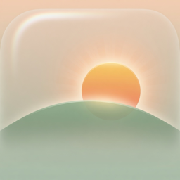
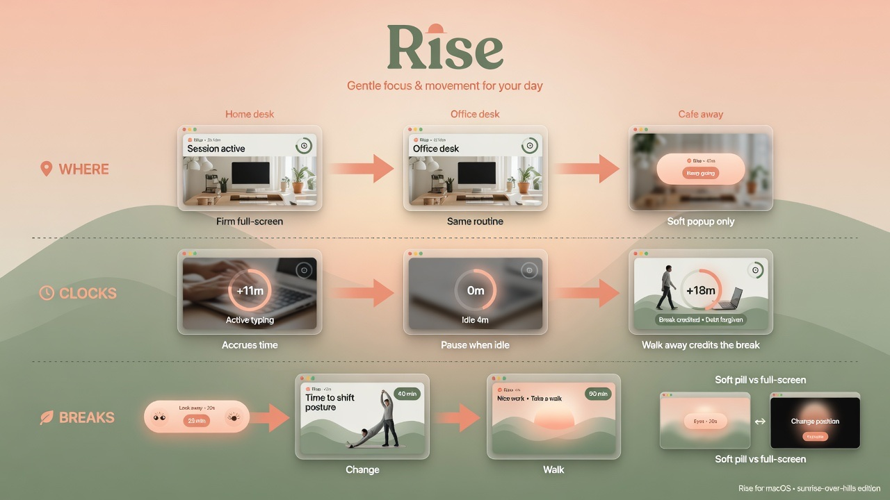

# Rise

<p align="center">
  
</p>

<p align="center">
  <strong>Micro-breaks for people who forget they have a body.</strong>
</p>

Native macOS menu-bar coach for desk work. Active-time clocks. Home & office full desk routine. Soft café popups when you’re out. No nag mid-video.

---

## How it works (one picture)

<p align="center">
  
</p>

| Track | What happens |
|--------|----------------|
| **Where** | **Home** and **Office** use the same full desk routine (firm full-screen when due). **Away** (café etc.) → soft floating popup only, seated-friendly moves. |
| **Clocks** | Time accrues only while you’re **actively** using the Mac. Idle pauses clocks. Walking away **credits** the break (debt is forgiven, not banked). |
| **Breaks** | **Eyes** ~25 min (soft pill) · **Change** ~40 min · **Walk** ~90 min. Soft never dims the whole screen; firm does at home/office. |

Full protocol: [`docs/PROTOCOL.md`](docs/PROTOCOL.md).

---

## Why

Your chair is fine. Your monitor height is fine. The problem is **you haven't moved in 47 minutes** and your neck is filing a formal complaint.

- Static posture loads the same tissues until they complain  
- Banner notifications get dismissed mid-sentence  
- Wall-clock timers nag you the second you sit down after a real walk  

Rise counts **desk work**, not calendar time. Leaving the keyboard is often already the break.

---

## Features

- **Activity-aware clocks** — pause for video / AFK; credit walks  
- **Home + Office places** — same routine; standing desk toggle per place  
- **Café mode** when away — extended soft popup, no full-screen hijack  
- **Soft eyes pill** vs **firm OLED coach** at the desk  
- **Menu bar** — next up, live countdown, modes, places  
- **Login item** — starts with your session  
- **Native Swift** — AppKit + SwiftUI  

---

## The layers

| | Every (active) | Time | What |
|---|-------|------|------|
| **A · Eyes** | ~25 min | ~30 s | Far gaze + blinks + posture (soft) |
| **B · Change** | ~40 min | ~90 s | Move / switch load (firm at desk) |
| **C · Walk** | ~90 min | 3–5 min | Real walk or café-friendly move |
| **S · Switch** | ~30 min | ~30 s | Sit ↔ stand (only if standing desk on) |

---

## Install (macOS)

### App (recommended)

```bash
git clone https://github.com/ethandey/rise-mac.git
cd rise-mac
bash scripts/install.sh
```

Installs **`/Applications/Rise.app`** (sunrise icon), LaunchAgent at login, data in:

`~/Library/Application Support/Rise`

### Package only (drag to Applications)

```bash
bash scripts/package-app.sh
open dist/          # Rise.app + Rise-1.1.0.zip
```

**Requirements:** macOS 13+, Xcode Command Line Tools (`xcode-select --install`) to rebuild.

CI packages the same app on every push to `main` (see [`.github/workflows/package.yml`](.github/workflows/package.yml)) and **requires the icon assets in git**.

---

## Assets in git

| Path | Role |
|------|------|
| [`assets/AppIcon/AppIcon.icns`](assets/AppIcon/AppIcon.icns) | Bundled into `Rise.app` |
| [`assets/AppIcon/AppIcon-1024.png`](assets/AppIcon/AppIcon-1024.png) | Master artwork |
| [`docs/app-icon.png`](docs/app-icon.png) | README / GitHub |
| [`docs/how-it-works.jpg`](docs/how-it-works.jpg) | Flow explainer (this page) |

`scripts/package-app.sh` copies the `.icns` into the app — no icon, no ship.

---

## Usage

Menu bar (menu-bar-only app — no Dock icon):

| Action | What it does |
|--------|----------------|
| **Next** line | Live countdown for the next break |
| **Modes** | Start Eyes / Change / Walk now |
| **Set Home Here** | Pin home to current location |
| **Set Office Here** | Pin office (same routine as home) |
| **Standing desk** | Per place; enables sit/stand switch |

CLI:

```bash
bin/rise --menubar
bin/rise --layer A   # Eyes
bin/rise --layer B   # Change
bin/rise --layer C   # Walk
```

---

## Uninstall

```bash
bash scripts/uninstall.sh
```

Removes login item and `/Applications/Rise.app`. Leaves Application Support prefs.

---

## Built with

- **Swift** — overlay + menu bar (`native/`)  
- **launchd** — login start  
- **Imagine** — app icon + how-it-works graphic  

---

## Contributing

PRs welcome — movement cues, accessibility, and “this broke on my Mac” reports.

---

## License

[MIT](LICENSE) © 2026 Ethan Dey

---

*Your spine has been in a stand-up all day. Rise is the adjournment.*
